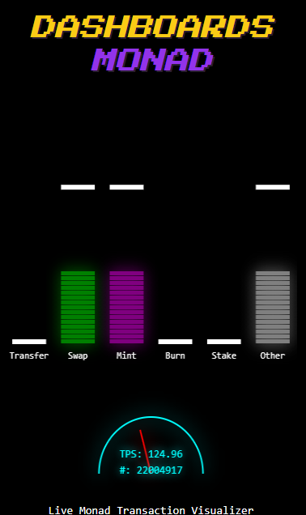

# Mission 4 – Monad Visualizer & Dashboard

A real-time visual dashboard powered by WebSocket data from the Monad network.



## 🚀 Overview

This project is a live visualizer that displays transaction types and network activity from the Monad blockchain in real time. It includes:

- Animated bar charts for transaction types (Transfer, Swap, Mint, Burn, Stake, etc.)
- A semi-circular TPS gauge with a dynamic needle
- Real-time block number and TPS display
- Retro-themed UI with canvas-based rendering
- Background soundtrack (looped)

All network activity is streamed directly via WebSocket.

## 🧠 Powered by @kadzu

We use the WebSocket backend provided by **@kadzu**, with explicit permission to access and extract real-time data. Special thanks to **@kadzu** for the open and supportive infrastructure.

**WebSocket endpoints used:**

- `wss://indexer-devhub.kadzu.dev/ws/analytics`

**Subscribed topics:**

- `new_transaction`
- `network_stats`

## 👥 Team

This project is built by a team of 4 members currently studying at the **Academy of Cryptography Techniques** (Học viện Kỹ thuật Mật mã), Vietnam.

Contact us via Discord:

- hahongetjs7664_48494
- sebastianschmid8421
- nguyenhoangson0496
- emikohotard

## 🔧 Tech Stack

- **Next.js 14**
- **React + Canvas API**
- **Tailwind CSS**
- **WebSocket** (live feed)
- **Custom retro font + pixel animations**

## 🕹️ Usage

To run locally:

```bash
npm install
npm run dev
```
